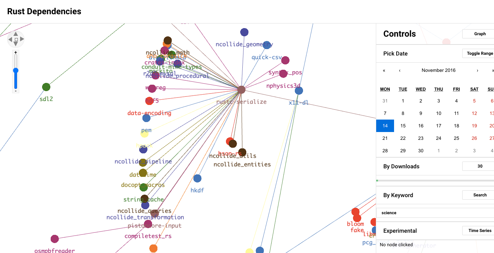

!Rust Dependencies Graph

A web application visualization of rust dependencies for the science keyword to 4 level depth. (Visualized using Graph.gl for networks and D3 for trees)

Start with "npm run dev" in the rust network folder

